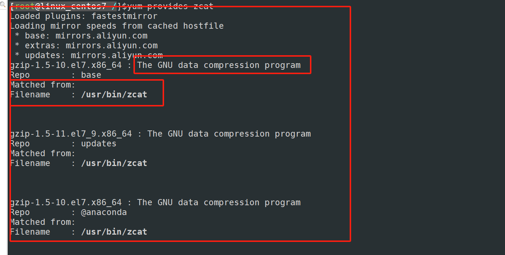

# 前后端分离token携带方式

在使用 JWT（JSON Web Token）进行会话管理时，Token 的存储和携带方式非常重要，这不仅影响应用的安全性，还影响用户体验。以下是几种常见的存储和携带方式及其优缺点：

### 1. **存储在 HTTPOnly Cookie 中**
将 JWT 存储在 HTTPOnly Cookie 中是一种常见的做法。这种方式的主要优点是安全性较高，因为 HTTPOnly 属性可以防止 JavaScript 访问 Cookie，从而减少 XSS（跨站脚本攻击）的风险。同时，通过设置 Secure 属性，可以确保 Cookie 只在 HTTPS 连接中传输，进一步提高安全性。然而，这种方式的缺点是可能会受到 CSRF（跨站请求伪造）攻击的影响。

**优点**：
- 高安全性，减少 XSS 攻击风险。
- 自动携带，无需前端手动处理。

**缺点**：
- 可能受到 CSRF 攻击。
- 需要正确配置 Cookie 属性（如 Secure、HttpOnly、SameSite）。

### 2. **存储在 LocalStorage 中**
将 JWT 存储在 LocalStorage 中也是一种常见的做法。这种方式的主要优点是前端可以方便地访问和操作 Token，适合需要在前端进行复杂逻辑处理的场景。然而，LocalStorage 的缺点是容易受到 XSS 攻击，因为 JavaScript 可以访问 LocalStorage 中的数据。

**优点**：
- 前端易于访问和操作。
- 适合复杂逻辑处理。

**缺点**：
- 容易受到 XSS 攻击。
- 需要前端手动在请求中携带 Token。

### 3. **存储在 SessionStorage 中**
SessionStorage 与 LocalStorage 类似，但存储的数据仅在当前浏览器会话期间有效，关闭浏览器后数据会被清除。这种方式在一定程度上提高了安全性，因为它减少了 Token 的存储时间，但仍然容易受到 XSS 攻击。

**优点**：
- 数据仅在当前会话有效，提高安全性。
- 前端易于访问和操作。

**缺点**：
- 容易受到 XSS 攻击。
- 需要前端手动在请求中携带 Token。

### 4. **携带方式**
无论 JWT 存储在何处，携带方式通常有两种：

#### a. **通过 HTTP 请求头携带**
这是最推荐的方式，因为 HTTP 请求头不会暴露在 URL 中，也不会受到 CSRF 攻击的影响。通常，JWT 被放在 `Authorization` 请求头中，格式如下：

```http
Authorization: Bearer <token>
```

**优点**：
- 安全性高，不会暴露在 URL 中。
- 不受 CSRF 攻击影响。

**缺点**：
- 需要前端手动在每个请求中添加请求头。

#### b. **通过 URL 参数携带**
这种方式不推荐，因为 Token 会暴露在 URL 中，可能会被记录在服务器日志或浏览器历史中，增加泄露风险。

**优点**：
- 实现简单。

**缺点**：
- 安全性低，Token 可能被记录和泄露。
- 受 CSRF 攻击影响。

### 推荐的做法
综合考虑安全性、易用性和兼容性，推荐将 JWT 存储在 HTTPOnly Cookie 中，并通过 HTTP 请求头携带。这种方式结合了高安全性和自动携带的优点，同时减少了 XSS 和 CSRF 攻击的风险。如果需要在前端进行复杂的逻辑处理，可以考虑将 JWT 存储在 LocalStorage 中，但必须采取额外的安全措施来防止 XSS 攻击。

### 示例代码
#### a. **存储在 HTTPOnly Cookie 中**
```javascript
// 设置 Cookie
document.cookie = "token=" + jwtToken + "; HttpOnly; Secure; SameSite=Strict";
```

#### b. **通过 HTTP 请求头携带**
```javascript
fetch('https://api.example.com/data', {
    method: 'GET',
    headers: {
        'Authorization': 'Bearer ' + jwtToken
    }
})
.then(response => response.json())
.then(data => console.log(data));
```

## 补充点：什么是OOM（内存溢出）

```
基本都是内存不足的故障。


1. 在线上的服务器，由于长时间程序运行，消耗内存，以及用户客户端的请求不断增多，或者瞬间而来的并发流量，后台进程都可能扛不住，无法正确解析响应，导致OOM（out of memory）
或者程序bug，导致内存用光，导致OOM，服务器崩溃，都是严重的bug。


2.例如某java程序，是OOM的常客，一个应用想要运行，假设需要2G内存，但是发现内存容量不够了，程序直接崩溃结束了


# 内存溢出与内存泄漏

1.内存溢出：（Out Of Memory---OOM）

系统已经不能再分配出你所需要的空间，比如系统现在只有1G的空间，但是你偏偏要2个G空间，这就叫内存溢出
例子：一个盘子用尽各种方法只能装4个果子，你装了5个，结果掉倒地上不能吃了。这就是溢出。


2.内存泄漏：  (Memory Leak)
强引用所指向的对象不会被回收，可能导致内存泄漏，虚拟机宁愿抛出OOM也不会去回收他指向的对象

意思就是你用资源的时候为他开辟了一段空间，当你用完时忘记释放资源了，这时内存还被占用着，一次没关系，但是内存泄漏次数多了就会导致内存溢出
（这就是为什么有时候，你某一个程序，开启的时间太久，导致机器特别卡，把它关了，重启后，内存小多了。）


# 总结：
	内存溢出：系统需要的内存(2G)你给不了(2G)，导致随着使用，系统崩溃
	内存泄漏：某些资源没有被释放，导致一致占用内存，随着时间的推移，其他程序需要内存，但是给不了内存，导致内存溢出，系统崩溃
```

## 补充点：查看程序命令来源于那个软件包

```
使用 yum 查找当前程序的来源那个程序包，进行安装
	yum provides 名称

比如：
	yum provides zcat
```




